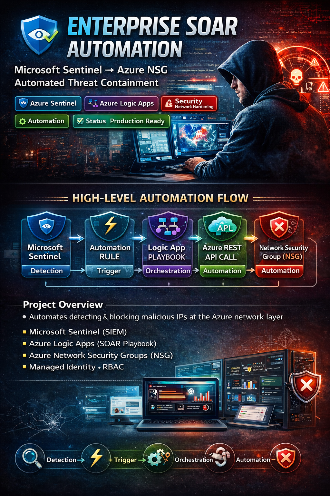
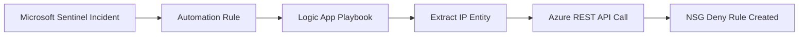
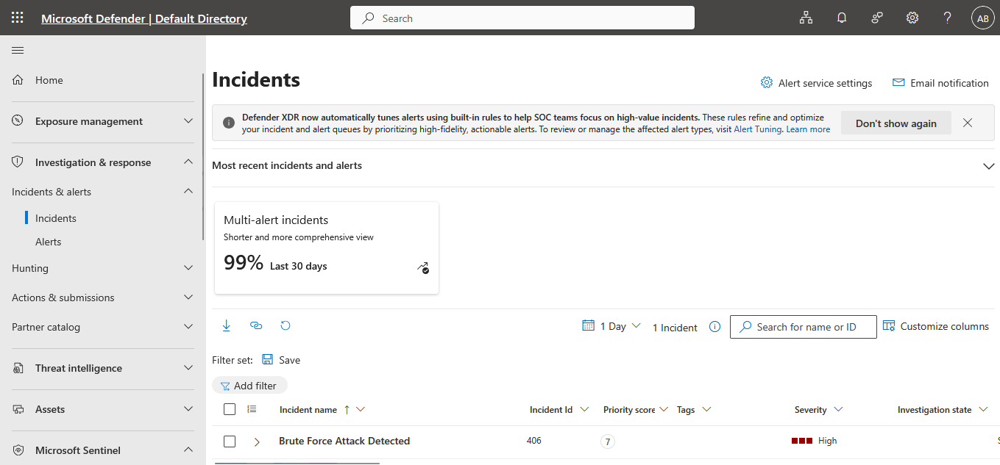
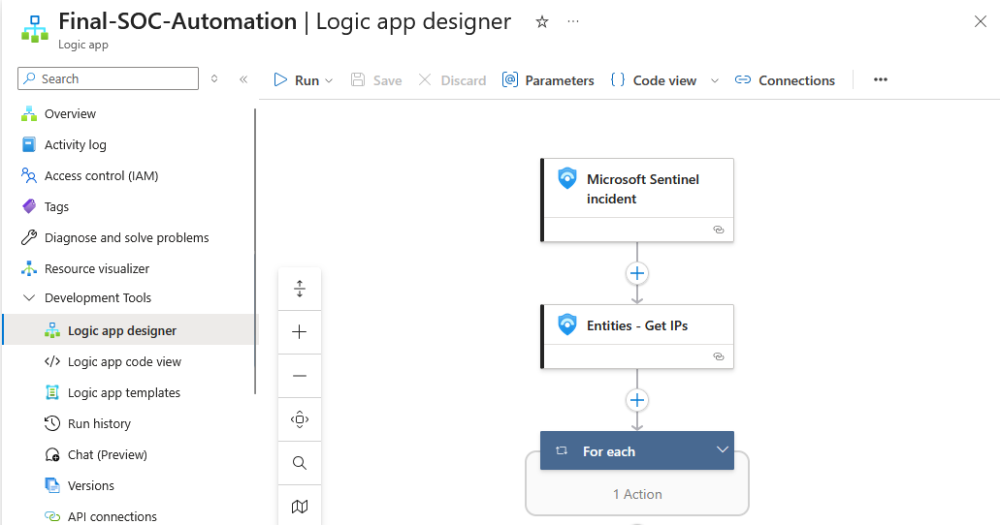
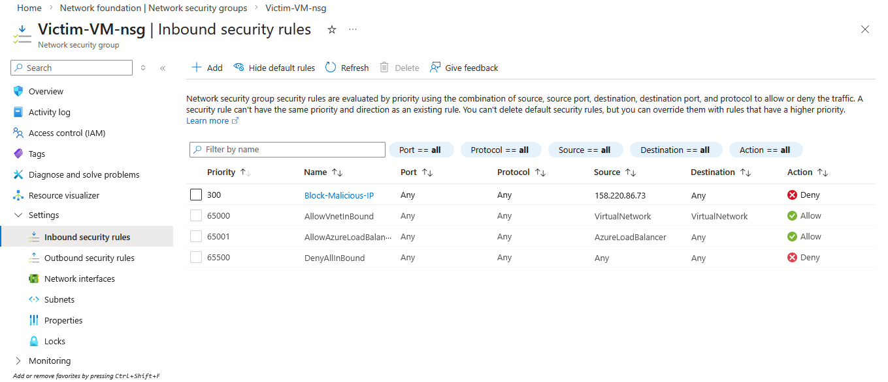

<p align="center">
  
</p>

<p align="center">
  <h1 align="center">🛡️ Enterprise SOAR Automation</h1>
  <h3 align="center">Microsoft Sentinel → Azure NSG Automated Threat Containment</h3>
</p>

<p align="center">
  
  
  
  
  
</p>

---

# 📌 Project Overview

This project demonstrates a **real-world Security Orchestration, Automation, and Response (SOAR)** implementation that automatically blocks malicious IP addresses at the Azure network layer.

The solution integrates:

- Microsoft Sentinel (SIEM)
- Azure Logic Apps (SOAR Playbook)
- Azure Network Security Groups (NSG)
- Azure RBAC + Managed Identity

It automates the complete:

> 🔍 Detection → ⚙️ Orchestration → 🚫 Enforcement lifecycle

---

# 🎯 Business Problem

Manual SOC response creates:

- High MTTR
- Human error risk
- Delayed containment
- Operational overhead

This solution reduces containment time from **minutes to seconds**.

---

# 🏗️ High-Level Architecture

## 🔄 Automation Flow



---

# ⚙️ Technical Implementation

## 1️⃣ Detection Layer – Sentinel

- Analytic Rule detects suspicious activity
- Incident automatically created
- IP entity extracted

---

## 2️⃣ Orchestration Layer – Logic App

Trigger:
```
When incident is created
```

Workflow Steps:

1. Parse Entities
2. For Each IP
3. HTTP PUT request to Azure Management API
4. Create dynamic NSG deny rule

Authentication:
- System-Assigned Managed Identity
- RBAC: Network Contributor
- No secrets stored

---

## 🌐 REST API Configuration

### HTTP Method
```
PUT
```

### Endpoint
```
https://management.azure.com/subscriptions/{subscriptionId}/resourceGroups/{resourceGroup}/providers/Microsoft.Network/networkSecurityGroups/{nsgName}/securityRules/Block-IP-{IP}?api-version=2022-09-01
```

### Request Body

```json
{
  "properties": {
    "protocol": "*",
    "sourcePortRange": "*",
    "destinationPortRange": "*",
    "sourceAddressPrefix": "{MaliciousIP}",
    "destinationAddressPrefix": "*",
    "access": "Deny",
    "priority": 300,
    "direction": "Inbound"
  }
}
```

Why PUT?
- Idempotent
- Prevents duplicates
- Safe automation design

---

# 🔐 Security Design Principles

- Principle of Least Privilege
- Managed Identity (no credentials exposed)
- Scoped RBAC access
- Controlled NSG priority range
- Auditable via Azure Activity Logs

---

# 📊 Execution Evidence

## 🔍 Sentinel Incident

Detected IP:
```
158.220.86.73
```



---

## 🔄 Logic App Run

Automation triggered successfully.



---

## 🚫 NSG Rule Created

Rule example:
```
Block-IP-158.220.86.73
```



---

# 🧠 MITRE ATT&CK Mapping

| Category | Mapping |
|----------|----------|
| Tactic | Credential Access |
| Technique | T1110 – Brute Force |
| Mitigation | Automated Network Containment |

---

# 📈 Performance Impact

| Metric | Before | After |
|--------|--------|--------|
| MTTR | 10–15 mins | < 30 seconds |
| Manual Steps | 5 | 0 |
| Human Error Risk | High | Eliminated |

---

# 🚀 Advanced Enhancement – Auto Expiry Feature

To prevent rule clutter:

Future improvement:

- Store rule creation timestamp
- Logic App scheduled job
- Delete rule after 24h
- Maintain security hygiene

---

# 🛠️ Production Hardening Recommendations

- Dynamic priority calculation
- IP validation logic
- GeoIP enrichment
- Threat intelligence lookup
- SOC email / Teams notification
- Logging to Log Analytics workspace

---

# 📁 Repository Structure

```
/images
   sentinel-incident.png
   logicapp-run.png
   nsg-rule.png
README.md
```

---

# 🎓 Skills Demonstrated

- Cloud Security Engineering
- SOAR Automation
- Azure REST API Integration
- Network Security Hardening
- RBAC & Managed Identity
- Incident Response Automation
- Enterprise Architecture Thinking

---

# 🔗 Connect

LinkedIn: https://www.linkedin.com/in/amal-udayanga-basnayake/  
GitHub:   https://github.com/AmalUBasnayake

---

# 🏁 Final Result

This project showcases a **real-world, enterprise-grade automated threat containment pipeline** built using Azure native security services.

> ⚡ From detection to network containment in seconds.
